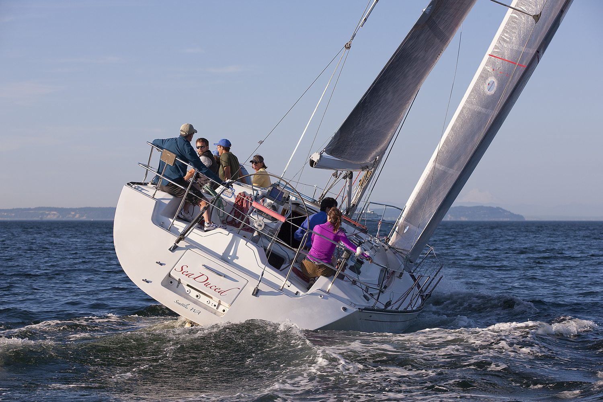
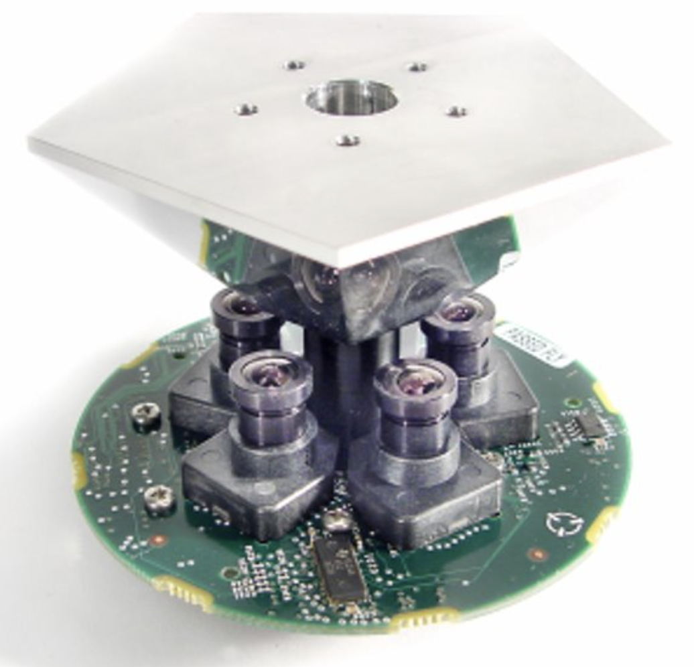

## Ross Cutler

I'm a Distinguished Engineer at Microsoft. I've been with Microsoft since 2000, joining Microsoft Research as a researcher after completing my Ph.D. in computer vision at the University of Maryland, College Park. My bachelor degrees are in computer science, math, and physics, and I'm comfortable building both software and hardware technologies. On this page, I'll include brief descriptions of some of the projects I've worked on, which have mostly been in the telecommunication domain - a very rich and satisfying area for applied research.

You can find more info about me on my [LinkedIn page](https://www.linkedin.com/in/rosscutler) and my [Microsoft Research page]( https://www.microsoft.com/en-us/research/people/rcutler). 

## Publications

My Google Scholar page is [here](https://scholar.google.com/citations?user=Qee1AwMAAAAJ&hl=en&oi=ao).
A complete list of publications is in my [CV](CV.pdf).

## Recent talks
- IEEE IEMCON Keynote, 2022.  Developing Machine Learning-Based Speech Enhancement Models for Teams and Skype
- RTC @ Scale, 2022. [Developing Machine Learning-Based Speech Enhancement Models for Teams and Skype](https://atscaleconference.com/videos/developing-machine-learning-based-speech-enhancement-models-for-teams-and-skype-ross-cutler)
- Intel Speech Conference Keynote, 2021.  Developing Machine Learning-Based Speech Enhancement Models for Teams and Skype
- INTERNOISE Keynote, 2021.  Developing Machine Learning-Based Speech Enhancement Models for Teams and Skype

## Projects
Below are some of the projects I've worked on.

### ML speech enhancement
The goal of this project is to replace millions of lines of DSP-based speech enhancement code in Teams/Skype with much better performing ML-based models that also offer new functionality. To do so we first created a scaleable crowdsourcing framework to rate 100's of thousands of clips cheaply and accurately. We created massive training and test sets to enable training ML models. We built the first accurate (PCC > 0.95) non-intrusive speech quality assessment models for speech in the presence of noise, echo, packet loss, reverberation, and PSTN distortions. We then created the first academic challenges for noise suppression, echo cancellation, and packet loss concealment. Finally, the models we built were integrated into Teams/Skype and AB tested to show significant end-to-end improvement. An example video of Deep Noise Suppression is [here](https://www.microsoft.com/en-us/videoplayer/embed/RE4Lri4). A more recent example of Deep Echo Cancellation, Noise Suppression, and Dereverberation in a single model is shown [here](https://www.youtube.com/watch?v=vii4bBqkINw). Examples of Deep Packet Loss Concealment are shown [here](https://techcommunity.microsoft.com/t5/microsoft-teams-blog/microsoft-teams-maintains-audio-quality-even-in-challenging/ba-p/3640516). These models are now used by 100's of millions of Teams/Skype users for all audio calls.

Some publications for this project are:

Challenges:
- [ICASSP 2023 Speech Signal Improvement Challenge](https://arxiv.org/pdf/2303.06566.pdf)
- [ICASSP 2023 Acoustic Echo Cancellation Challenge](https://www.researchgate.net/publication/366205532_ICASSP_2023_ACOUSTIC_ECHO_CANCELLATION_CHALLENGE#fullTextFileContent)
- [ICASSP 2023 Deep Noise Suppression Challenge](https://www.microsoft.com/en-us/research/academic-program/deep-noise-suppression-challenge-icassp-2023)
- [INTERSPEECH 2022 Audio Deep Packet Loss Concealment Challenge](https://arxiv.org/pdf/2204.05222.pdf)
- [ConferencingSpeech 2022 Challenge: Non-intrusive Objective Speech Quality Assessment (NISQA) Challenge for Online Conferencing Applications](https://arxiv.org/pdf/2203.16032.pdf)
- [ICASSP 2022 Deep Noise Suppression Challenge](https://arxiv.org/pdf/2202.13288.pdf)
- [ICASSP 2022 Acoustic Echo Cancellation Challenge](https://arxiv.org/pdf/2202.13290.pdf)
- [INTERSPEECH 2021 Acoustic Echo Cancellation Challenge](https://www.researchgate.net/profile/Ross-Cutler/publication/352135082_INTERSPEECH_2021_ACOUSTIC_ECHO_CANCELLATION_CHALLENGE/links/60ba7de5458515218f8f8b88/INTERSPEECH-2021-ACOUSTIC-ECHO-CANCELLATION-CHALLENGE.pdf)
- [ICASSP 2021 Deep Noise Suppression Challenge](https://arxiv.org/pdf/2009.06122.pdf)
- [ICASSP 2021 Acoustic Echo Cancellation Challenge: Datasets, testing framework, and results](https://arxiv.org/pdf/2009.04972.pdf)
- [INTERSPEECH 2021 Deep Noise Suppression Challenge](https://arxiv.org/pdf/2101.01902.pdf)
- [The INTERSPEECH 2020 Deep Noise Suppression Challenge: Datasets, subjective testing framework, and challenge results](https://arxiv.org/pdf/2005.13981.pdf)

Speech quality assessment models:
- [DNSMOS P.835: A non-intrusive perceptual objective speech quality metric to evaluate noise suppressors](https://arxiv.org/pdf/2110.01763.pdf)
- [AECMOS: A speech quality assessment metric for echo impairment](https://arxiv.org/pdf/2110.03010.pdf)
- [DNSMOS: A non-intrusive perceptual objective speech quality metric to evaluate noise suppressors](https://arxiv.org/pdf/2010.15258.pdf)
- [Intrusive and non-intrusive perceptual speech quality assessment using a convolutional neural network](https://www.researchgate.net/profile/Hannes-Gamper/publication/336722543_Intrusive_and_Non-Intrusive_Perceptual_Speech_Quality_Assessment_Using_a_Convolutional_Neural_Network/links/5daf5407a6fdccc99d92c60b/Intrusive-and-Non-Intrusive-Perceptual-Speech-Quality-Assessment-Using-a-Convolutional-Neural-Network.pdf)
- [DNN no-reference PSTN speech quality prediction](https://arxiv.org/pdf/2007.14598.pdf)
- [Non-intrusive speech quality assessment using neural networks](https://arxiv.org/pdf/1903.06908.pdf) 
- [Supervised classifiers for audio impairments with noisy labels](https://arxiv.org/pdf/1907.01742.pdf)

Speech quality labeling:
- [Crowdsourcing approach for subjective evaluation of echo impairment](https://arxiv.org/pdf/2010.13063.pdf)
- [An open source implementation of ITU-T recommendation P.808 with validation](https://arxiv.org/pdf/2005.08138.pdf)
- [Subjective evaluation of noise suppression algorithms in crowdsourcing](https://arxiv.org/pdf/2010.13200.pdf)
- [Speech Quality Assessment in Crowdsourcing: Comparison Category Rating Method](https://arxiv.org/pdf/2104.04371.pdf)

Models, optimizations, other:
- [Aura: Privacy-preserving augmentation to improve test set diversity in noise suppression applications](https://arxiv.org/pdf/2110.04391.pdf)
- [Performance optimizations on deep noise suppression models](https://arxiv.org/pdf/2110.04378.pdf)
- [MusicNet: Compact Convolutional Neural Network for Real-time Background Music Detection](https://arxiv.org/pdf/2110.04331.pdf)
- [A scalable noisy speech dataset and online subjective test framework](https://arxiv.org/pdf/1909.08050&ved=2ahUKEwjMr6LD3aPqAhXtYd8KHZ7ECl0QFjAAegQIBRAC&usg=AOvVaw01MCa2LbkZ3KXTi21FHjsq)
- [Weighted speech distortion losses for neural-network-based real-time speech enhancement](https://arxiv.org/pdf/2001.10601.pdf)

### ML video codec

The goal of this project is to create an ML-based video codec with >2X the coding efficiency of H.266/VVC. We are following a similar approach to our ML speech enhancement process. We first created an accurate video quality assessment tool that can label millions of clips cheaply. We helped organize an ML video codec challenge that uses this video quality assessment tool. And we will work with other companies to create a new ML video codec standard.

Challenges:

- [CVPR 2022 Workshop and Challenge on Learned Image Compression](http://compression.cc)
- [DCC 2024 Workshop and Challenge on Learned Image Compression](http://compression.cc)

Publications:

- [A crowdsourcing approach to video quality assessment](https://arxiv.org/pdf/2204.06784.pdf)

### Meeting effectiveness and inclusiveness

Meetings are a pervasive method of communicating in companies and consume a lot of time and resources. The goal of this project was to determine if we could effectively measure the effectiveness and inclusiveness of meetings, and ultimately improve them. There has been research in modeling meeting effectiveness, but no prior research on measuring or modeling meeting inclusiveness. We provide the first methodology to measure and model meeting effectiveness and inclusiveness and show how they can be improved. One specific area to improve meeting inclusiveness is to better allow remote speakers to interrupt and talk in meetings, which we address with the first failed speech interruption model we are aware of. A demo video is [here](speech_interruption.mp4).

Publications:

- [Real-time Speech Interruption Analysis: From Cloud to Client Deployment](https://arxiv.org/pdf/2210.13334.pdf)
- [Meeting effectiveness and inclusiveness in remote collaboration](https://arxiv.org/ftp/arxiv/papers/2102/2102.09803.pdf)
- [Improving meeting inclusiveness using speech interruption analysis, ACM MM 2022]()

### ML bandwidth estimation and control

The goal of this project is to estimate how much bandwidth we can send across the internet for video calls. Traditionally this has been solved with classic control theory. We are using machine learning and in particular deep reinforcement learning. This is an especially challenging problem because, unlike audio or video, the data here is the internet, which is impossible to simulate accurately. 

Publications:

- [Reinforcement learning for bandwidth estimation and congestion control in real-time communications](https://arxiv.org/pdf/1912.02222.pdf)

### Active speaker detection

I've been working on active speaker detection (ASD) since graduate school, where I developed the first neural network solution for multi-modal fusion to detect active speakers with a single microphone and camera. Since then I've implemented ASD several more times using microphone arrays, depth cameras, and deep learning, and have shipped it in multiple products, including Microsoft RoundTable. ASD is still an active area of research and still a project I'm working on.

Publications:

- [Multimodal active speaker detection and virtual cinematography for video conferencing](https://arxiv.org/ftp/arxiv/papers/2002/2002.03977.pdf)
- [Boosting-based multimodal speaker detection for distributed meeting videos](https://www.microsoft.com/en-us/research/wp-content/uploads/2017/01/TMM08_SpeakerDet.pdf)
- [Look who's talking: Speaker detection using video and audio correlation](http://citeseerx.ist.psu.edu/viewdoc/download?doi=10.1.1.118.3968&rep=rep1&type=pdf)

### Light field camera/display video conferencing

The ultimate type of remote conferencing will preserve eye gaze, who is looking at who, have accurate spatial geometry, and achieve the same level of trust, empathy, meeting effectiveness and inclusiveness, and fatigue as face-to-face meetings. It will require new types of displays and cameras to achieve this. Two prototypes I've worked on called TeleWall and TeleWindow are designed to meet these goals using light field cameras and AR glasses. 

Patents:

- [Dynamic detection and correction of light field camera array miscalibration](https://patentimages.storage.googleapis.com/eb/20/41/2705d3c87c6fb5/US11270464.pdf)
- [Light field camera modules and light field camera module arrays](https://patentimages.storage.googleapis.com/a3/2c/d5/20ca14ab6fabdd/US11082659.pdf)
- [Device pose detection and pose-related image capture and processing for light field based telepresence communications](https://patentimages.storage.googleapis.com/a3/4b/5e/521c551eb78bbb/US11064154.pdf)
- [Telepresence devices operation methods](https://patents.justia.com/patent/11089265)
- [Telepresence device](https://patentimages.storage.googleapis.com/90/ed/24/586dfac44277a6/US10554928.pdf)

### Camera designs

I've designed several types of cameras for human motion capture and teleconferencing besides the above light field cameras. My first commercial design was the RoundTable camera, a high-resolution 360-degree camera using a pentagonal prism and view cameras to minimize stitching error. That design was later made HD and shipped by Polycom. A newer 360-degree cost-reduced design uses just two cameras. I've also designed some front-of-the-room cameras, privacy-preserving webcams, and whiteboard cameras. Some of these are described below.

Publications:

- [Design and implementation of the University of Maryland Keck Laboratory for the analysis of visual movement](https://drum.lib.umd.edu/bitstream/handle/1903/1180/CS-TR-4329.pdf?sequence=1)

Patents:

- [360 degree camera](https://patentimages.storage.googleapis.com/3d/34/4c/fca70cf18e1b4c/US20200296268A1.pdf)
- [Multi-view integrated camera system with housing](https://patentimages.storage.googleapis.com/d4/e7/ff/36292762a25688/US7593057.pdf)
- [Maintenance of panoramic camera orientation](https://patentimages.storage.googleapis.com/9d/92/2c/867d239df0bb08/US7593042.pdf)
- [Omni-directional camera with calibration and up look angle improvements](https://patentimages.storage.googleapis.com/76/0d/63/df483481631f08/US7495694.pdf)
- [Whiteboard view camera](https://patentimages.storage.googleapis.com/6d/bc/62/011395e6a341b8/US7397504.pdf)
- [Omni-directional camera design for video conferencing](https://patentimages.storage.googleapis.com/76/d9/e2/d058e6ff9386c6/US7298392.pdf)
- [Camera lens shuttering mechanism](https://patentimages.storage.googleapis.com/5a/62/47/a587719c6a0680/US7812882.pdf)

### Video DSP 

I've implemented many video DSP components, including panoramic stitching, smart gain control, camera calibration for panoramic cameras, normalizing the size of heads in video conferences, and demosaicing (used in Matlab and NASA Mars missions). Some of these are described below:

Publications:

- [High-quality linear interpolation for demosaicing of Bayer-patterned color images](https://citeseerx.ist.psu.edu/viewdoc/download?doi=10.1.1.432.6368&rep=rep1&type=pdf)
- [Automatic head-size equalization in panorama images for video conferencing](https://www.microsoft.com/en-us/research/wp-content/uploads/2016/02/tr-2005-48.pdf)
- [Head-size equalization for improved visual perception in video conferencing](https://www.microsoft.com/en-us/research/publication/2016/11/Head-size-Equalization-for-Improved-Visual-Perception-in-Video-Conferencing.pdf)
- [Practical calibrations for a real-time digital omnidirectional camera](https://citeseerx.ist.psu.edu/viewdoc/download?doi=10.1.1.134.2186&rep=rep1&type=pdf)

Patents:

- [Parametric calibration for panoramic camera systems](https://patentimages.storage.googleapis.com/ec/6c/3f/b25dfe6aad38d6/US7697839.pdf)
- [Temperature compensation in multi-camera photographic devices](https://patentimages.storage.googleapis.com/da/13/c9/10b78e7d00eafa/US7602412.pdf)
- [Privacy camera](https://patentimages.storage.googleapis.com/05/19/d5/9edd837fc95357/US9124762.pdf)
- [System and method for camera calibration and images stitching](https://patentimages.storage.googleapis.com/16/29/2a/6c3dae8d1cd36c/US7936374.pdf)
- [Minimizing dead zones in panoramic images](https://patentimages.storage.googleapis.com/75/cd/60/00323a6be7264d/US7782357.pdf)
- [Speaker and person backlighting for improved AEC and AGC](https://patentimages.storage.googleapis.com/6e/f6/ad/fe00f85d6ff2de/US8130257.pdf)
- [Automatic gain and exposure control using region of interest detection](https://patentimages.storage.googleapis.com/99/8c/c4/295c2f0110564b/US8165416.pdf)
- [Automatic detection of panoramic camera position and orientation table parameters](https://patentimages.storage.googleapis.com/e3/5d/25/cd878e016ec20c/US7630571.pdf)
- [System and method for camera color calibration and image stitching](https://patentimages.storage.googleapis.com/46/7b/da/0d1dd6d83d19f5/US7259784B2.pdf)
- [Automatic video framing](https://patentimages.storage.googleapis.com/55/f1/30/01adf7d692cb52/US8773499.pdf)
- [Techniques for detecting a display device](https://patentimages.storage.googleapis.com/7d/c7/1e/fd57a819e39d5c/US8614734.pdf)

### Audio DSP

I've implemented a number of audio DSP components also, such as speaking while muted detection, improved echo cancellers, and audio-based device discovery. Some of these are described below:

Patents:

- [Mute control in audio endpoints](https://patentimages.storage.googleapis.com/57/b5/df/a6777037f60fa2/US8620653.pdf)
- [Removing near-end frequencies from far-end sound](https://patentimages.storage.googleapis.com/99/03/f3/174aeb42e522f8/US8744069.pdf)
- [Endpoint echo detection](https://patentimages.storage.googleapis.com/74/59/e3/3b65ba44c604cc/US8488745.pdf)
- [Reducing echo](https://patentimages.storage.googleapis.com/pdfs/US8433061.pdf)
- [Enhanced discovery for ad-hoc meetings](https://patentimages.storage.googleapis.com/0f/34/10/2ba34aaeeea873/US9882990.pdf)
- [System and process for discovery of network-connected devices at remote sites using audio-based discovery techniques](https://patentimages.storage.googleapis.com/67/15/af/b7cfb519cd9f61/US7525928.pdf) 
- [System and method for communicating audio data signals via an audio communications medium](https://patentimages.storage.googleapis.com/48/94/e1/cde04f9386cdf0/US6934370.pdf)
- [Audio start service for Ad-hoc meetings](https://patentimages.storage.googleapis.com/6d/bd/88/cbfb939fef0b39/US8245043.pdf)

### Acoustic designs

I've designed the physical acoustics for several shipping speakerphones. Some are described below:

Patents:

- [Audio device](https://patentimages.storage.googleapis.com/26/01/38/700e2a98dfc061/US20210136471A1.pdf)
- [Method and system of varying mechanical vibrations at a microphone](https://patentimages.storage.googleapis.com/c1/1d/a3/06e62010525eb7/US10575110.pdf)
- [Satellite microphones for improved speaker detection and zoom](https://patentimages.storage.googleapis.com/ab/07/a7/cc174296f3cd6a/US8314829.pdf)
- [Satellite microphone array for video conferencing](https://patentimages.storage.googleapis.com/a3/a5/bd/0ca743b7eaa196/US8189807.pdf)
- [Microphone array for a camera speakerphone](https://patentimages.storage.googleapis.com/e1/3e/c6/f5cc2d36e3d075/US8526632.pdf)
- [Boundary binaural microphone array](https://patentimages.storage.googleapis.com/dc/3e/b1/93fe8582b5b450/US9516417.pdf)

### Audio / video device quality

I wrote the first several versions of the Skype / Teams video quality certification specifications and tools, which is the PC industry standard for how to measure the video quality for webcams. I also co-authored the Skype / Teams audio quality certification specifications, which is the PC industry standard for how to measure the send and receive audio quality. Both were developed after designing my own cameras and audio endpoints.

Specifications:

- [Microsoft Teams and Skype for Business specifications for USB peripherals, PCs, and Microsoft Teams Room systems, versions 1-3](https://docs.microsoft.com/en-us/skypeforbusiness/certification/test-spec)
- [Microsoft Lync Specifications for USB peripherals, PCs, and Lync room systems, versions A-F](https://docs.microsoft.com/en-us/skypeforbusiness/certification/test-spec)

### Periodic motion detection and analysis

Part of my Ph.D. thesis was on detecting and analyzing periodic motion, especially biological motion like human gait. This work showed you can detect biological motion with very few pixels, and even identify people using this motion. 

Publications:

- [Gait recognition using image self-similarity](https://link.springer.com/content/pdf/10.1155/S1110865704309236.pdf)
- [View-invariant estimation of height and stride for gait recognition](https://citeseerx.ist.psu.edu/viewdoc/download?doi=10.1.1.113.3944&rep=rep1&type=pdf)
- [Stride and cadence as a biometric in automatic person identification and verification](https://citeseerx.ist.psu.edu/viewdoc/download?doi=10.1.1.10.3749&rep=rep1&type=pdf)
- [Motion-based recognition of people in eigengait space](http://citeseerx.ist.psu.edu/viewdoc/download?doi=10.1.1.5.1270&rep=rep1&type=pdf)
- [Eigengait: Motion-based recognition of people using image self-similarity](http://citeseerx.ist.psu.edu/viewdoc/download?doi=10.1.1.92.172&rep=rep1&type=pdf)
- [Robust real-time periodic motion detection, analysis, and applications](http://citeseerx.ist.psu.edu/viewdoc/download?doi=10.1.1.34.3779&rep=rep1&type=pdf)

### Mathematics genealogy
I have rich lineage of Ph.D. advisers, including these famous researchers:

- David Hilbert
- Felix Klein
- Rudolf Otto Sigismund Lipschitz
- Carl Friedrich Gauss
- Siméon Denis Poisson
- Jean-Baptiste Joseph Fourier
- Joseph Louis Lagrange
- Pierre-Simon Laplace
- Leonhard Paul Euler
- Johann Bernoulli
- Jacob Bernoulli
- Friedrich Leibniz
- Johannes Kepler
- Nicolaus Copernicus

For more details see [here](cutler_math_genealogy.pdf).

